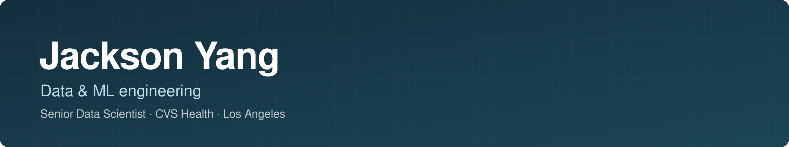

Senior Data Scientist at CVS Health in Los Angeles. I build the data and ML engineering underneath production models: streaming pipelines, distributed training, ML platforms, and LLM agent workflows. Previously supply-chain forecasting at Walmart.

### What I build

| Data pipelines | ML platforms | LLM systems |
|:--|:--|:--|
| Kafka → Spark → Iceberg CDC streaming with partition pruning and pre-aggregation | Distributed PyTorch training on Ray across GPUs | Pydantic AI multi-agent extraction with evidence checks and human review |
| Data contracts enforced in CI with Great Expectations | Auto-forecasting package with backtesting and retail calendars built in | Agentic RAG over BigQuery and planning reports |

### Projects

| Project | What it does |
|:--|:--|
| **[copytrading](https://github.com/YZXBiz/copytrading)** Swift · Python · SQLite · OpenTelemetry | Native macOS app that turns Discord trade calls into risk-checked Alpaca orders: LLM parsing, position limits, full tracing |
| **[ml-platform-demo](https://github.com/YZXBiz/ml-platform-demo)** Python · Kubernetes · CI/CD | End-to-end ML platform: training pipelines, model serving, monitoring, and CI/CD on Kubernetes |
| **[safe-model-deployment](https://github.com/YZXBiz/safe-model-deployment)** Python · A/B testing | Champion–challenger deployment with traffic splitting, sequential A/B tests, and automated rollback |
| **[model-observability](https://github.com/YZXBiz/model-observability)** Python · Monitoring | Production model monitoring: PSI/KL drift detection, latency SLOs, automated alerting |
| **[gpu-ml-learning](https://github.com/YZXBiz/gpu-ml-learning)** CUDA · Triton | GPU programming for ML, built up through hands-on kernels in Triton and CUDA |

### Stack

Los Angeles, CA · [LinkedIn](https://www.linkedin.com/in/jackson-y/)
